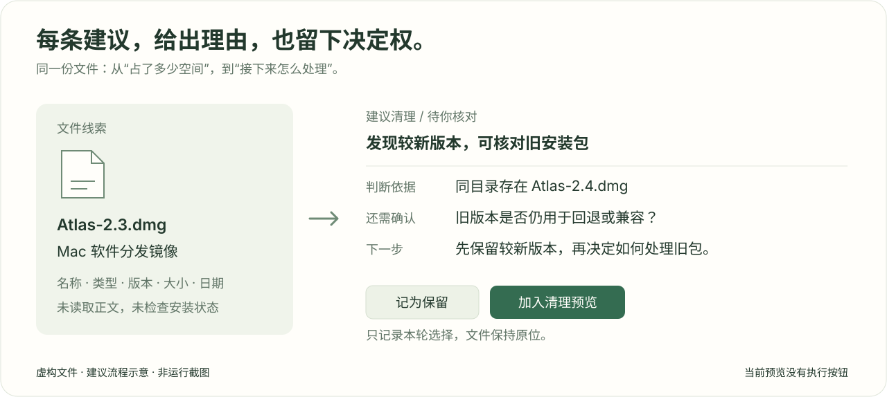

<div align="center">
  
  <h1>空间透视 · Space Perspective</h1>
  <p><strong>先看懂文件，再决定怎么整理。</strong></p>
  <p>解释文件是什么，建议哪些可以清理、哪些应该归档、哪些值得保留。</p>
  <p><a href="README_EN.md">English</a> · <a href="https://github.com/fy-agent">A fy-agent project</a></p>
  <p>
    <a href="LICENSE"></a>
    
    
    <a href="https://github.com/fy-agent/space-perspective/actions/workflows/macos.yml"></a>
  </p>
  <p><a href="#快速开始"><strong>从源码体验</strong></a> · <a href="docs/roadmap.md">产品路线</a> · <a href="https://github.com/fy-agent/space-perspective/issues">反馈与想法</a> · <a href="CONTRIBUTING.md">参与贡献</a></p>
</div>

<p align="center"></p>

## 让每一次整理都有依据

下载目录里可能同时放着旧安装包、重复下载的附件、工作资料和一时认不出的文件。
真正难的是判断：**它是什么？还留着做什么？现在处理会不会后悔？**

空间透视是一款本地优先的文件整理助手。它把文件线索整理成可解释的建议，让你看到
推荐动作、判断依据和仍需确认的条件，再自己决定。产品目标是逐步完成
“看懂 → 分类 → 建议 → 预览 → 可恢复处理”的整理流程。

> **当前状态：Mac 早期开发预览。** 原生窗口可对你通过系统选择器授权的 Downloads
> 生成分类和建议。这个入口只读取文件名、路径、类型、大小和修改时间；不读取正文，
> 不联网，不移动或删除文件。目前提供源码构建，尚无签名、公证的正式安装包。

## 它会给你什么建议

| 建议 | 帮你判断什么 | 示例 |
| --- | --- | --- |
| **建议清理** | 哪些安装包、疑似下载副本值得优先核对 | 同目录已有较新版本；确认无需回退后，再考虑旧安装包 |
| **建议归档** | 哪些资料应离开临时下载目录 | 较早的文档、图片或音视频，按项目和用途整理 |
| **重要资料** | 哪些文件需要优先保护 | 名称或路径出现合同、财务、招聘、交接等线索 |
| **建议保留** | 哪些内容目前有明确的保留理由 | 较新安装包、用于对照的文件、项目代码与配置 |
| **需要判断** | 还缺少哪些信息才能作决定 | 压缩包是否已解压、未知文件的用途、程序是否仍需运行 |

每一项都说明 **是什么、为什么、依据什么、还要确认什么、下一步怎么做**。
你可以继续按文件类型筛选，记为保留，或把候选加入清理预览；本轮决定可以撤销，退出后清除。

<p align="center"></p>
<p align="center"><sub>以上为使用虚构文件绘制的建议流程示意，不是运行截图，也不含用户文件数据。</sub></p>

## 从看见文件到作出决定

1. **选择范围**：通过 Mac 系统选择器授权自己的 Downloads 文件夹。
2. **生成建议**：先看清理、归档和保留分组，再按类型缩小范围。
3. **核对依据**：点开文件，查看版本对照、名称线索、修改日期和确认条件。
4. **作出选择**：记为保留，或者加入只读清理预览。
5. **结束访问**：关闭目录访问后，仍可查看本次结果；原文件始终留在原处。

当前建议是可检查的本地规则。相似名称和相同大小只会产生“疑似副本”提示，
不会被称为精确重复；修改时间也不等于最后使用时间。候选体积不代表已确认可释放空间。

## 快速开始

需要 macOS 13+、Xcode Command Line Tools、Rust stable 和 Python 3.12+。
目前已完成本地 Apple Silicon 运行验证；Intel Mac 尚未单独验收。
构建时需要联网下载依赖，运行中的原生建议应用不联网。

```bash
git clone https://github.com/fy-agent/space-perspective.git
cd space-perspective

# 首次构建先下载锁定的 Rust 依赖
cargo fetch --locked --manifest-path desktop/Cargo.toml

# 构建没有文件处理后端的 Downloads 只读应用
python3 scripts/mac001_build.py --build --read-only-downloads

open "output/mac-001-native-20260919/downloads-read-only/Space Perspective Read Only.app"
```

打开后点击“选择下载文件夹…”，再点击“分析并生成建议”。构建产物使用本机临时签名，
并绑定构建账号的 Downloads 路径，适合本机开发体验，不是跨机器分发包。
更多步骤见[原生 Mac 开发说明](desktop/README.md)。

## 当前能力与下一步

| 能力 | 原生 Mac 预览版 |
| --- | --- |
| 系统目录选择器、只读范围授权 | 已实现，目前限定 Downloads |
| 文件类型、用途线索、五类建议 | 已实现，基于本地元数据规则 |
| 逐项理由、版本对照、保留与清理预览 | 已实现；选择只在本轮内存中保存 |
| 正文理解、OCR、语义相似识别 | 尚未实现 |
| 已安装软件核验、精确内容去重 | 尚未接入原生预览入口 |
| 真实文件处理与可靠恢复 | 尚未开放；延迟或重启后的恢复仍有阻塞 |
| 签名公证的安装包、Windows 桌面版 | 后续计划 |

仓库也包含 Python Core 与 React 工作台，供开发者研究索引、报告、精确去重和隔离收据等
已有实验能力。它们与原生 Mac 入口的能力范围不同，详见[架构](docs/architecture.md)
和[开发指南](docs/development.md)。

## 常见问题

<details>
<summary><strong>会读取文件内容或上传数据吗？</strong></summary>

原生 Downloads 入口不读取正文、不计算文件内容 hash、不联网。分类来自名称、路径、后缀、
大小和修改时间。文件明细与选择保存在进程内存，本地日志只记录汇总和操作结果。
隐藏项、软链接、应用包、多硬链接和跨卷内容会跳过；结果不代表整个磁盘的完整盘点。
详见[隐私与文件边界](docs/privacy-invariants.md)。

</details>

<details>
<summary><strong>“加入清理预览”会真的删除文件吗？</strong></summary>

不会。这个构建中没有移动、Trash 或恢复后端，预览也没有执行按钮。
目前重要资料不能加入清理预览。未来只有在恢复可靠性通过验证后，才会开放用户确认的文件处理。

</details>

<details>
<summary><strong>现在使用 AI 模型判断了吗？</strong></summary>

还没有。当前原生窗口使用可解释的本地规则，不需要模型账号。
内容理解属于后续工作，不能把现有名称线索当作已经读懂正文。
Python 实验工作台中的 fake provider 也只是离线测试替身。

</details>

## 参与这个项目

空间透视由 [fy-agent](https://github.com/fy-agent) 发布，欢迎一起完善文件整理体验。
我们尤其需要：可复现的错误分类样例、更清楚的建议文案、Mac 范围授权与恢复测试，
以及后续的 Windows 适配。请使用自己构造的样例，提交前移除私人文件名、路径和内容。

- [报告问题或提出想法](https://github.com/fy-agent/space-perspective/issues)
- [贡献指南](CONTRIBUTING.md) · [开发与验证](docs/development.md)
- [产品路线](docs/roadmap.md) · [安全问题报告](SECURITY.md)

## 许可证

本项目以 [MIT License](LICENSE) 开源。依赖保留各自的版权与许可证，见
[第三方依赖说明](THIRD_PARTY_NOTICES.md)。README 展示图使用本项目绘制的图形和虚构样例。
